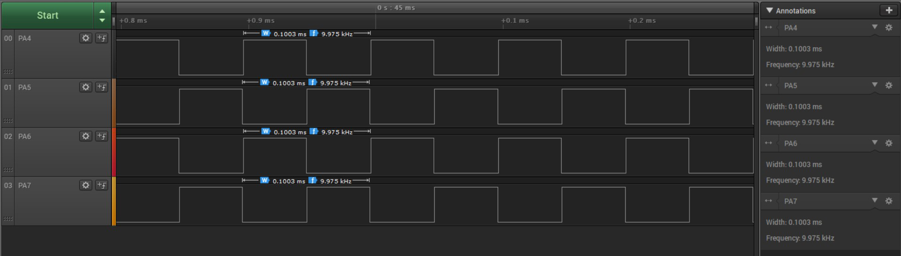
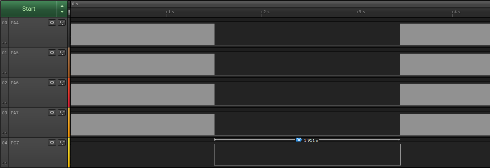

 # Controlling Synchronous Signals Using Input Events

This application shows how to configure the Timer/Counter Type D (TCD) to generate four signals of 10 kHz frequency, synchronized in pairs and how to configure an input channel for fault detection. As long as the input channel value is low, the TCD stops the outputs.

## Related Documentation
More details and code examples on the AVR128DA48 can be found at the following links:
- [TB3212-Getting Started with Timer/Counter Type D (TCD)](https://ww1.microchip.com/downloads/en/Appnotes/TB3212-Getting-Started-with-TCD-DS90003212.pdf)
- [AVR128DA48 Product Page](https://www.microchip.com/wwwproducts/en/AVR128DA48)
- [AVR128DA48 Code Examples on GitHub](https://github.com/microchip-pic-avr-examples?q=avr128da48)
- [AVR128DA48 Project Examples in START](https://start.atmel.com/#examples/AVR128DA48CuriosityNano)

## Software Used
- MPLAB® X IDE 5.40 or newer [(microchip.com/mplab/mplab-x-ide)](http://www.microchip.com/mplab/mplab-x-ide)
- MPLAB® XC8 2.30 or a newer compiler [(microchip.com/mplab/compilers)](http://www.microchip.com/mplab/compilers)
- MPLAB® Code Configurator (MCC) 4.0.1 or newer [(microchip.com/mplab/mplab-code-configurator)](https://www.microchip.com/mplab/mplab-code-configurator)
- MPLAB® Code Configurator (MCC) Device Libraries 8-bit AVR® MCUs 2.5.0 or newer [(microchip.com/mplab/mplab-code-configurator)](https://www.microchip.com/mplab/mplab-code-configurator)
- AVR-Dx 1.4.75 or newer Device Pack

## Hardware Used
- AVR128DA48 Curiosity Nano [(DM164151)](https://www.microchip.com/Developmenttools/ProductDetails/DM164151)

## Setup

The AVR128DA48 Curiosity Nano Development Board is used as test platform.

 

The following configurations must be made for this project:

System clock is configured at 3.33 MHz.

TCD0:
-   TCD0 clock source is the High-Frequency Oscillator at 20 MHz with division factor 4
-   TCD0 is configured in Four Ramp mode, with channel C matching channel A and channel D matching channel B
-   CMPASET and CMPBSET registers set to 0x02, CMPACLR and CMPBCLR set to 0xF6 (the values from these registers are continuously compared to the counter value, controlling in this way the generated waveform and the dead time)
-   Waveform A and B are set to input mode stop output, jump to opposite compare cycle and wait
-   All output channels (A, B, C, D) are enabled
-   Event A is configured to trigger a fault on the falling edge or low level of event, with Input Capture Noise Cancellation Filter enabled

EVSYS:
-   PC7 configured as event generator on CHANNEL2
-   TCD0INPUTA configured as event user on CHANNEL2

PC7 configured as digital input with internal pull-up resistor enabled.

 |Pin                       | Configuration      |
 | :---------------------:  | :----------------: |
 | PA4                      | Digital Output     |
 | PA5                      | Digital Output     |
 | PA6                      | Digital Output     |
 | PA7                      | Digital Output     |
 | PC7                      | Digital Input      |

 ## Operation
1.  Connect the board to the PC.

2.  Open the Controlling_synchronous_signals_using_input_events.X project in MPLAB® X IDE.

3.  Set the Controlling_synchronous_signals_using_input_events.X project as main project. Right click on the project in the **Projects** tab and click **Set as Main Project**.

 

4.  Clean and build the Controlling_synchronous_signals_using_input_events.X project. Right click on the **Controlling_synchronous_signals_using_input_events.X** project and select **Clean and Build**.

 

5.  Select the **AVR128DA48 Curiosity Nano** in the Connected Hardware Tool section of the project settings:

- Right click on the project and click **Properties**
- Click on the arrow under the Connected Hardware Tool
- Select the **AVR128DA48 Curiosity Nano** (click on the **SN**), click **Apply** and then click **OK**:

 

6.  Program the project to the board. Right click on the project and click **Make and Program Device**.

 

Demo:

 

The first image shows the four signals on pins PA4, PA5, PA6, and PA7. PA4 and PA6 are the same and PA5 and PA7 are complementary to those.

 

The second image shows what happens while the button is pressed. The signals stop and wait for the button to be released.

 ## Summary

This program shows how to configure the TCD to generate four signals with 10 kHz frequency that can be stopped when a fault is detected.