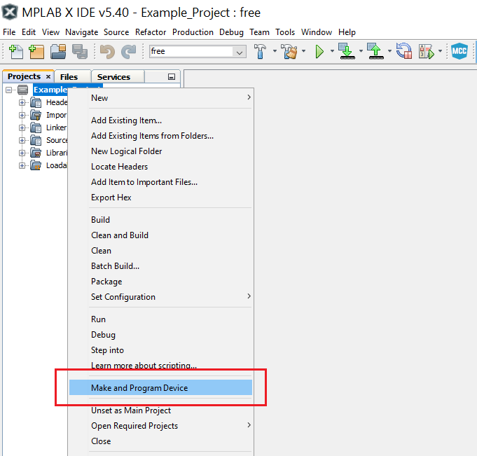
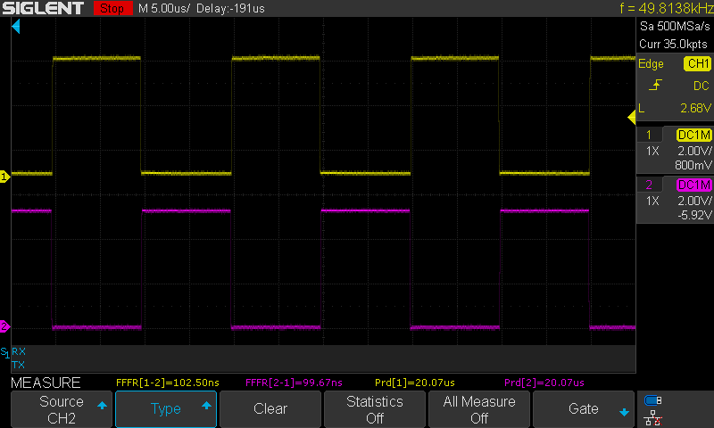
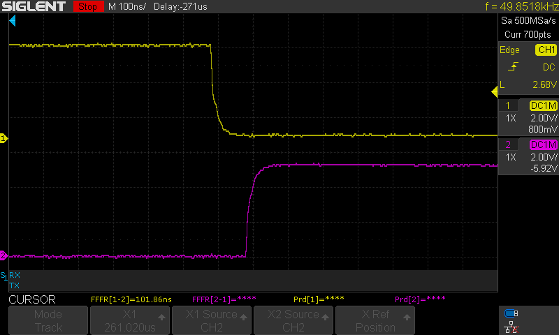

 # Generating Complementary Driving Signals

This program shows how to configure the Timer/Counter Type D (TCD) to generate two complementary signals with 50 kHz frequency and 100 ns dead time.

## Related Documentation
More details and code examples on the AVR128DA48 can be found at the following links:
- [TB3212-Getting Started with Getting Started with Timer/Counter Type D (TCD)](https://ww1.microchip.com/downloads/en/AppNotes/TB3212-Getting-Started-with-TCD-90003212A.pdf)
- [AVR128DA48 Product Page](https://www.microchip.com/wwwproducts/en/AVR128DA48)
- [AVR128DA48 Code Examples on GitHub](https://github.com/microchip-pic-avr-examples?q=avr128da48)
- [AVR128DA48 Project Examples in START](https://start.atmel.com/#examples/AVR128DA48CuriosityNano)

## Software Used
- MPLAB® X IDE 5.40 or newer [(microchip.com/mplab/mplab-x-ide)](http://www.microchip.com/mplab/mplab-x-ide)
- MPLAB® XC8 2.30 or a newer compiler [(microchip.com/mplab/compilers)](http://www.microchip.com/mplab/compilers)
- MPLAB® Code Configurator (MCC) 4.0.1 or newer [(microchip.com/mplab/mplab-code-configurator)](https://www.microchip.com/mplab/mplab-code-configurator)
- MPLAB® Code Configurator (MCC) Device Libraries 8-bit AVR® MCUs 2.5.0 or newer [(microchip.com/mplab/mplab-code-configurator)](https://www.microchip.com/mplab/mplab-code-configurator)
- AVR-Dx 1.4.75 or newer Device Pack

## Hardware Used
- AVR128DA48 Curiosity Nano [(DM164151)](https://www.microchip.com/Developmenttools/ProductDetails/DM164151)

## Setup

The AVR128DA48 Curiosity Nano Development Board is used as test platform.

 

The following configurations must be made for this project:

System clock is configured at 3.33 MHz.

TCD0:
-   TCD0 clock source is the High-Frequency Oscillator at 20 MHz with division factor 1
-   The TCD0 is configured in Dual Slope mode, CMPBCLR equal to 0xC8, CMPASET equal to 0x63 and CMPBSET equal to 0x65 (the values from these registers are continuously compared to the counter value, controlling in this way the generated waveform and the dead time)
-   Channel A (PA4) and channel B (PA5) are enabled

**Note:** Due to the way MCC assings pins, pins PA6 and PA7 will also generate the waveform available on PA4.

 |Pin                       | Configuration      |
 | :---------------------:  | :----------------: |
 | PA4                      | Digital Output     |
 | PA5                      | Digital Output     |

 ## Operation
1.  Connect the board to the PC.

2.  Open the Generating_complementary_driving_signals.X project in MPLAB® X IDE.

3.  Set the Generating_complementary_driving_signals.X project as main project. Right click on the project in the **Projects** tab and click **Set as Main Project**.

 

4.  Clean and build the Generating_complementary_driving_signals.X project. Right click on the **Generating_complementary_driving_signals.X** project and select **Clean and Build**.

 

5.  Select the **AVR128DA48 Curiosity Nano** in the Connected Hardware Tool section of the project settings:

- Right click on the project and click **Properties**
- Click on the arrow under the Connected Hardware Tool
- Select the **AVR128DA48 Curiosity Nano** (click on the **SN**), click **Apply** and then click **OK**:

 

6.  Program the project to the board. Right click on the project and click **Make and Program Device**.

 

Demo:

The image below shows the complementary signals on PA4 and PA5 pins.

 

The dead times are showed in the image below.

 
 

 ## Summary

This program shows how to configure the TCD to generate two complementary signals with dead-time.
